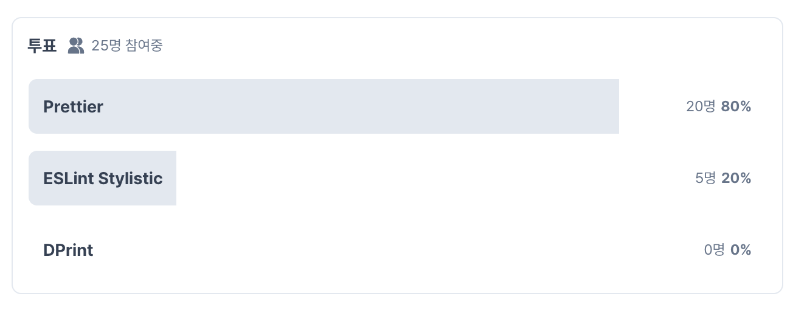

> [Deprecation of formatting rules - ESLint - Pluggable JavaScript Linter](https://eslint.org/blog/2023/10/deprecating-formatting-rules/)

 

## 포맷팅 규칙 관리의 부담감

ESLint 는 기존에 `정적 코드 분석` + `코드 포맷팅` 기능을 지원해왔습니다.

코드 포맷팅 기능이란 `사용자가 미리 정의해놓은 규칙으로 자동 정렬해주는 기능`을 말합니다.

 

ESLint는 JavaScript의 큰 성장과 동시에 인기가 증가함에 따라 유지 관리에 점차 부담이 가기 시작했습니다.
ESLint 팀은 JavaScript 빠른 성장에 맞춰 구문의 변화에 따라가고자 기존의 규칙을 업데이트하거나, 새로운 규칙을 추가해달라는 요청이 쇄도했고, 점차 유지 보수에 부담이 가고, 벅찬 지경까지 오게 되었다고 합니다.

 

이에 따라 ESLint는 하나의 목표인 정적 코드 분석에 집중하기 위해 코드 포맷팅 기능을 제거하기로 결정을 내렸습니다. 결정을 내리게 된 것 중 하나는 이미 시중에 전용 코드 포맷터 라이브러리들이 편중화되어 있기 때문이었다고 합니다.

 

## 포맷팅 규칙 제거로 인한 대체방안

ESLint 팀에서는 포맷 규칙이 제거됨에 따라 이를 대체하기 위해 `전문 코드 포맷터`를 도입하는 것을 제안합니다.

아래는 ESLint 팀에서 제안한 코드 포맷터입니다.

1. Prettier
2. DPrint
3. ESLint Stylistic

 

---

### Prettier

- 포맷팅 전문 라이브러리.
- 포맷팅에 전문화되어있기 때문에 세세한 규칙들까지 적용되어있다.

### DPrint

- Rust 기반 포맷팅 전문 라이브러리.
- Prettier와 거의 유사하고, 속도가 빠르다.

### ESLint Stylistic

- ESLint에서 제거된 포맷팅 관련 규칙들을 모아놓은 라이브러리.
- 기존에 포맷팅 규칙을 사용한 프로젝트에서 제거된 규칙들을 해당 라이브러리를 통해 사용 가능하다.
- 각각의 규칙에 대해 옵션을 지정할 수 있으며 총 91가지의 규칙을 제공한다.

---

 

## 코드 포맷터 선호도 조사

실제로 `Prettier 가 시중에 많이 사용`되고 있고, `기존 ESLint 포맷터를 사용하던 사용자들`은 `ESLint Stylistic 도입을 고려`할 것으로 유추됩니다.

Link : [Prettier vs ESLint Stylistic vs DPrint](https://careerly.co.kr/qnas/5871?utm_campaign=user-share)

 

 

## ESLint Stylistic 을 선택한 이유

ESLint Stylistic 을 선택한 이유는 사실 간단합니다. 기존에 코드 컨벤션이 어느정도 잡혀있었기 때문에 변경점을 최소화하며 규칙을 세세하게 정할 수 있기 떄문입니다.

 
DPrint는 적용 사례가 많지 않고, 사실상 ESLint Stylistic과 Prettier 사이에서 고민을 했다. 아래는 두 포맷터의 장/단점을 정리한 내용입니다.

 

### Prettier

- 기존 프로덕트들에서 Prettier 가 쉽게 사용되기 때문에, 신규 입사자분이 오셨을때 해당 규칙에 더 익숙하다.
- 다른 포맷터들에 비해 더 오래된 전문 포맷터로, 세세한 규칙들가지 적용해준다.
- [printWidth 규칙 논쟁과 제한적으로 제공하는 규칙들](https://runebook.dev/ko/docs/prettier/options?source=post_page-----ac5a16f6b3db--------------------------------#print-width)

 

### ESLint Stylistic

- 기존 규칙들을 반영하여 변경점을 최소화할 수 있다.
- 90개 이상의 규칙을 제공하며, 팀 내에서 원하는 코드 스타일을 적용할 수 있다.
- 세세한 포맷팅까지 해주진 않는다. (Prettier 는 규칙을 제한적으로 제공하는 대신 세세한 규칙들을 자동으로 포맷팅해준다의 차이..?)

 

결론적으로 ESLint Stylistic을 채택했고, 기존 컨벤션을 재정비하며 90개 이상의 규칙들을 논의하는 자리를 가졌습니다.
ESLint Stylistic 은 아직 점유율이 낮은편이고, 곧 많은 사람들이 넘어와 기여를 통해 더 높은 품질의 코드 포맷터가 될 것이라고 생각합니다.

 

> [ESLint Stylistic 컨트리뷰터가 되었습니다!](https://www.linkedin.com/posts/haezzz_release-v170-eslint-stylisticeslint-stylistic-activity-7175782836568788992-qMnu?utm_source=share&utm_medium=member_ios)

 

## 마치며

이 전 회사에서는 아무 생각 없이 Prettier 를 사용하며 편하게 코드를 작성할 수 있었습니다. 하지만 기존에 ESLint 만으로 구성된 프로젝트에 참여하게 되면서 `코드 포맷터의 중요성`을 다시 한 번 느꼈고, 최소한의 코드 컨벤션으로 각기 다른 코드 스타일로 인해 PR 코멘트가 빈번했었습니다.

이번 작업으로 `코드 스타일에 대한 코멘트가 줄어들고`, ESLint Stylistic의 90개 이상의 규칙을 팀원들과 같이 논의하며 규칙들 하나하나에 대해 알아보고 적용하는 과정이 매우 흥미로운 경험이었습니다.
