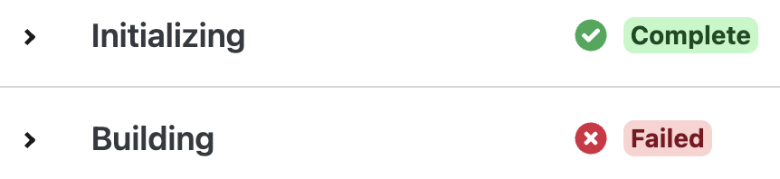
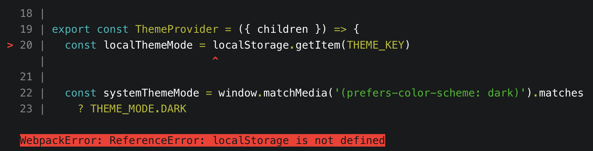
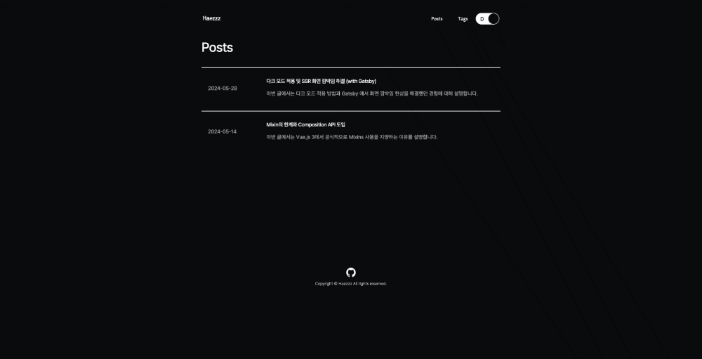

## 들어가기에 앞서

Gatsby 를 이용해 블로그 만들기를 시작하면서, 다크 모드 적용과 UI를 빠르게 구현하기 위해서 TailwindCSS, Material UI 등 UI 라이브러리 도입을 고민했습니다. 하지만 구현해야할 페이지와 컴포넌트가 다소 적기 때문에 배보다 배꼽이 더 크다 생각되어, SCSS와 모듈 방식을 선택했습니다.

이번 포스팅에선 Gatsby 블로그 구축 과정 중 CSS를 이용해 다크 모드를 적용한 경험과 마주친 문제를 해결해나간 과정을 공유해보려고합니다.

<br/>

## 테마 모드에 따른 색상 토큰 적용하기

일반적으로 테마 모드를 적용하는 방법은 두 가지가 있습니다.

1. **시스템 테마 `prefers-color-schema` 미디어 쿼리 사용**

- 장점 : CSS 만으로 테마를 구현할 수 있다.
- 단점 : light, dark 테마 모드만 적용 가능하고, 사용자의 시스템 설정을 무조건 따라야한다.

2. **body 태그에 테마에 따라 class 추가**

- 장점 : light, dark 이외의 다른 테마 모드도 적용 가능하고, 테마 변경이 자유롭다.
- 단점 : CSS 만으로 제어할 수 없고, 제어를 위한 추가 스크립트를 구현해야한다.

<br/>

### 1. 미디어 쿼리를 이용한 다크 모드 적용

`prefers-color-scheme` 는 미디어 쿼리로 CSS에서 제공하는 기능 중 하나입니다. `prefers-color-scheme` 를 통해 사용자의 화면 모드에 따라 정의된 컬러가 적용됩니다.

<br />

<details>
    <summary>스크립트에서 시스템 화면 모드 확인 방법</summary>

<div>

```js
// prefers-color-scheme 미디어 쿼리 값이 `dark` 인 지 매칭
window.matchMedia('(prefers-color-scheme: dark)').matches
```

</div>

</details>

```css
@media (prefers-color-scheme: dark) {
  :root {
    --bg1: #1b1b1e;
    --bg2: #f8f9fc;
    --textColor: #f8f9fc;
    --borderColor: #f8f9fc;
  }
}
```

<br/>

이렇게 간단히 미디어 쿼리를 이용해 테마 모드를 적용할 수 있지만, 여기서 주의해야될 점이 있습니다.

- `prefers-color-scheme` 미디어 쿼리는 몇몇 구 버전에서는 지원되지 않습니다. ([브라우저 호환성 확인](https://developer.mozilla.org/en-US/docs/Web/CSS/@media/prefers-color-scheme#browser_compatibility))
- 항상 시스템의 결정에 따라 컬러모드를 결정해야 한다는 한계가 있습니다.

<br/>

### 2. body 태그에 테마 모드 값 부여하기

body 태그에 테마 모드에 대한 class를 추가하여 CSS를 적용하는 방법입니다.

> 🙋🏻 : 그럼 테마 모드별로 CSS를 각각 작성해줘야되나요?!
>
> 🍎 : 전역 CSS 변수를 이용해 토큰을 사전에 정의한 후 해당 토큰을 이용해 CSS를 작성함으로써 CSS를 여러벌 작성해야되는 번거로움을 최소화할 수 있습니다.

<br />

**적용 순서**

1. 테마별 컬러 토큰을 CSS 전역 변수로 정의합니다.
2. 정의한 CSS 변수를 활용해 CSS를 작성합니다.
3. 테마 모드 변경을 위한 스크립트를 작성합니다.

<br />

body에 CSS 변수를 정의하여 body 하위의 요소에서 변수를 사용할 수 있도록 합니다.

이제 body 태그의 class 에 따라 CSS 변수가 변경되므로, CSS 작성 시 정의한 토큰을 활용해 작성해주시면 됩니다.

```css
body {
  -—background-color: #ffffff;
  —-text-color: #000000;
}

body.dark {
  -—background-color: #000000;
  -—text-color: #ffffff;
}

button {
  background-color: var(-—background-color);
  color: var(-—text-color);
}
```

<br/>

### 테마 모드 제어

**User Story Scenarios**

1. 사용자가

이제 테마 모드 제어를 위해 스크립트를 추가해줍니다.
시스템 환경 모드에만 의존하지 않고, 사용자가 직접 변경한 모드를 지속하기 위해선 어떻게 해야할까요?

아래는 **시스템 모드와 로컬 스토리지를 활용**하여 테마 모드를 가져오고, 변경하는 함수입니다.

```js
// 현재 테마 모드 가져오기
const getThemeMode = () => {
  // STEP 1. 로컬 스토리지 값 조회
  const localMode = localStorage.getItem('theme-mode')

  // STEP 2. 시스템 모드 값 조회
  const isSystemDarkMode = window.matchMedia('(prefers-color-scheme: dark)').matches
  const systemMode = isSystemDarkMode ? 'dark' : 'light'

  // STEP 3. 우선적으로 사용자가 설정한 로컬 스토리지 값을 가져온다.
  return localMode ?? systemMode // 로컬 스토리지 값이 없다면 시스템 모드 적용
}

// 테마 모드 변경하기
const setThemeMode = mode => {
  // STEP 1. 사용자가 설정한 모드를 로컬 스토리지에 저장
  localStorage.setItem(mode)

  // STEP 2. 설정한 모드로 body 태그에 class 추가/삭제한다.
  if (mode === 'light') {
    window.document.body.classList.add('dark')
  } else {
    window.document.body.classList.remove('dark')
  }
}
```

<br/>

페이지에 첫 접근했을때 테마 적용을 위해 useEffect hook을 추가해줍니다.

사용자가 웹사이트에 첫 접근하면 사용자의 시스템 모드가 적용되고, 이 후에 사용자가 테마 모드를 변경할 경우 이를 로컬 스토리지에 저장하여 다음에도 같은 결과값을 보여줄 수 있습니다.
**페이지 첫 접근 시 적용된 테마 설정**

```js
useEffect(() => {
  // STEP 1. 현재 테마 모드 가져오기
  const currentMode = getThemeMode()

  // STEP 2. body 태그에 class 추가
  window.document.body.classList.add(currentMode)

  // STEP 3. 로컬 스토리지에 테마 모드 값 갱신
  localStorage.setItem('theme-mode', currentMode)
}, [])
```

<br/>

## 서버 사이드 환경(SSR)에서 다크 모드 적용 시 화면 깜박임 해결

마지막으로 CSR과 SSR의 상태가 달라 발생하는 화면 깜박임 오류에 대해 다뤄보려고합니다.

서버가 터졌습니다..💣



Gatsby 는 정적으로 페이지를 생성하는 SSG 방식을 사용합니다. v4가 공개되고부터는 SSG 방식 외에도 서버 사이드 렌더링(SSR) 방식 또한 지원합니다. Gatsby 로컬 서버는 CSR 방식으로 동작되기 때문에 발생하지 않았던 오류가 실제 서버에 반영되었을때 발생한 것이였습니다..
먼저 오류를 해결하기 위해서 로컬 서버에서도 SSR 로 동작되어야하는데, 다행이 Gatsy 에서는 로컬 서버에서도 SSR 로 동작될 수 있게 옵션을 제공합니다.
gatsby-config.js 파일에 `DEV_SSR`옵션을 추가해줍니다.

```js
module.exports = {
  // ...
  flags: {
    // NOTE: 로컬 서버에서 SSR 확인을 위해 true 로 변경
    DEV_SSR: true,
  },
  // ...
}
```



localStorage 는 브라우저에서만 사용 가능한 API이기 때문에 아래와 같이 예외 처리를 추가해줍니다.

```js
if (typeof window !== undefined) { ... }
```



사용자는 `dark` 테마를 선택했지만, 초기 테마 모드가 `light`이기 때문에 화면 깜박임이 발생한다.
SSR과 CSR의 상태가 다르기 때문인데, 하이드레이팅되는 시점에 `light` -> `dark` 테마로 변경되었기 때문이다.
실제 서버에서 html를 생성하는 시점에는 typeof window !== undefined 로 모드 적용 코드가 예외 처리되었기 때문에 서버에서는 light 테마의 html 를 생성한다. 그 후 하이드레이팅되며 테마가 적용되었기 때문에 화면 깜박임 현상이 발생하는 것이다.
이를 해결하기 위해선 SSR과 CSR의 상태를 매칭해줘야하는데, 테마를 적용하는 로직을 스크립트 최상단에서 먼저 실행함으로써 해결할 수 있다.

<br/>

화면의 첫 진입점인 `index.html` 내에 스크립트를 추가하여 초기 모드 값을 가져와 세팅한다.
gatsby 에선 gatsby.ssr.js 파일에서 dom이 페인팅되기 전에 스크립트를 먼저 실행되도록 추가해주었다.

**index.html**

```html{7-15}
<!DOCTYPE html>
<html lang="en">
  <head>
    ...
  </head>
  <body>
    <script>
      const localThemeMode = localStorage.getItem('${THEME_KEY}')
      const systemThemeMode = window.matchMedia('(prefers-color-scheme: dark)').matches
        ? 'dark'
        : 'light'

      const currentMode = localThemeMode ?? systemThemeMode
      document.body.classList.add(currentMode)
    </script>
    <div id="root"></div>
  </body>
</html>
```

<br/>

**gatsby.ssr.js**

```js
/**
 * @type {import('gatsby').GatsbySSR['onRenderBody']}
 */
export const onRenderBody = ({ setHtmlAttributes, setPreBodyComponents }) => {
  const preloadScript = `
    const localThemeMode = localStorage.getItem('${THEME_KEY}')
    const systemThemeMode = window.matchMedia('(prefers-color-scheme: dark)').matches ? 'dark' : 'light'

    const currentMode = localThemeMode ?? systemThemeMode
    document.body.classList.add(currentMode)
  `

  setHtmlAttributes({ lang: `en` })
  setPreBodyComponents(<script dangerouslySetInnerHTML={{ __html: preloadScript }} />)
}
```

<br/>

마지막으로 페이지 첫 렌더링 시 초기값을 적용하기 위해 useEffect hook 을 수정합니다.

body 에 추가된 테마 클래스를 가져와 SSR과 CSR 테마 상태를 hydration 해줍니다.

```js
useEffect(() => {
	// STEP 1. 현재 테마 모드 가져오기
	const currentMode = getThemeMode()

	// STEP 2. body 태그에 class 추가
	window.document.body.classList.add(currentMode)

	// STEP 3. 로컬 스토리지에 테마 모드 값 갱신
	localStorage.setItem('theme-mode', currentMode)

  useEffect(() => {
    // NOTE: 브라우저 환경에서만 실행
    if (isBrowser) {
      const currentMode = window.document.body.classList.contains(THEME_MODE.DARK)
        ? THEME_MODE.DARK
        : THEME_MODE.LIGHT
      setTheme({ ...theme, mode: currentMode })
    }
  }, [])
```

<br/>

## 마치며

CSS 를 이용해 다크 모드를 적용하는 방법에 대해 정리해보았습니다. 실무에서는 성능과 유지보수의 부담과 다양한 상황에 유연하게 대응하기 위해서 자체적으로 개발해야될 때가 옵니다.

"바퀴를 다시 발명하지 마라"라는 말과 같이 미리 만들어진 바퀴는 개발 시간을 단축시켜줄 순 있지만, 우리는 바퀴를 발명해야되는 순간도 발생할 수 있습니다. 이 때 우리는 다시 순수 html, css, javascript만을 이용해 개발할 수 있어야합니다.

<br/>
<br/>

## 참고

- [웹에서 다크모드 지원하기 | 카카오엔터테인먼트 FE 기술블로그](https://fe-developers.kakaoent.com/2021/211118-dark-mode)
- [Gatsby 블로그 다크 테마 적용하기](https://godsenal.com/posts/gatsby-블로그-다크-테마-적용하기/)
